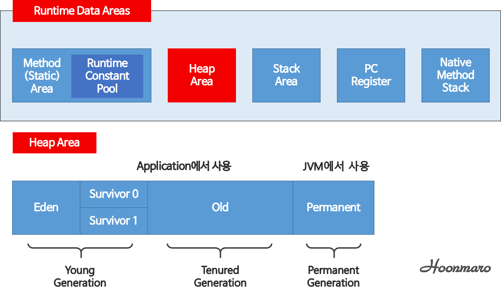

- 힙 영역에서 더 이상 사용되지 않는 인스턴스들을 메모리 상에서 자동으로 제거
- **stop the world** (이 과정 중에는 모든 스레드가 멈춤)
    1. stack의 모든 변수를 스캔하며 대응되는 heap의 인스턴스를 찾음(marking)
    2. mark되지 않은 heap의 인스턴스를 모두 제거(sweep)
- Young 영역(Yong Generation 영역)
    - 새롭게 생성한 객체의 대부분이 여기에 위치한다.
    - 이 영역에서 객체가 사라질때 Minor GC가 발생한다고 말한다.
- Old 영역(Old Generation 영역)
    - 접근 불가능 상태로 되지 않아 Young 영역에서 살아남은 객체가 여기로 복사(Promotion)된다.
    - 이 영역에서 객체가 사라질 때 Major GC(혹은 Full GC)가 발생한다고 말한다.

