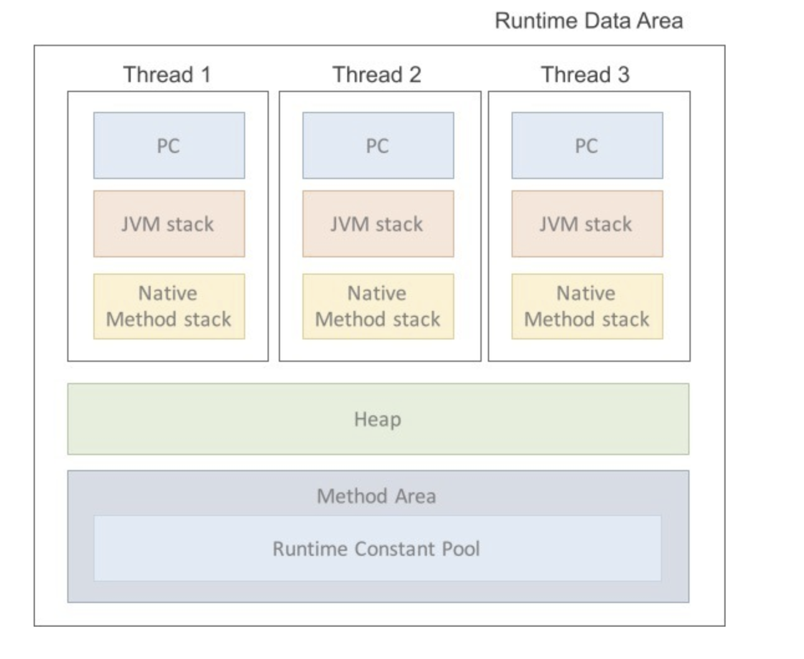

- **Method (Static) Area**:
    - JVM이 읽어들인 클래스와 인터페이스 대한 런타임 상수 풀, 멤버 변수(필드), 클래스 변수(Static 변수), 생성자와 메소드를 저장하는 공간이다.
- **Runtime Constant Pool**
    - JVM은 consant pool의 internal version인 runtime constant pool을 갖는다.
    - 클래스 파일 constant_pool 테이블에 해당하는 영역이다.
    - 클래스와 인터페이스 상수, 메소드와 필드에 대한 모든 레퍼런스를 저장한다.
    - JVM은 런타임 상수 풀을 통해 해당 메소드나 필드의 실제 메모리 상 주소를 찾아 참조한다
- **Heap Area**
    - JVM이 관리하는 프로그램 상에서 데이터를 저장하기 위해 런타임 시 동적으로 할당하여 사용하는 영역이다.
    - New 연산자로 생성된 객체 또는 객체(인스턴스)와 배열을 저장한다.
    - 참조하는 변수나 필드가 없다면 의미 없는 객체가 되어 GC의 대상이 된다.
- **Stack Area**
    - 각 스레드마다 하나씩 존재하며, 스레드가 시작될 때 할당된다.
    - 메소드를 호출할 때마다 프레임(메서드 수행정보)를 추가(push)하고, 메소드가 종료되면 해당 프레임(메서드 수행정보)을 제거(pop)하는 동작을 수행한다.
        
        ex)
        ```
        // 재귀함수
        int fibonnaci(int n) {
        	if (n == 1) return 1;
        	else if (n == 2) return 1;
        	return fibonnaci(n - 1) +  fibonnaci(n - 2);
        }
        ```

    - 메소드 정보, 지역변수, 매개변수, 연산 중 발생하는 임시 데이터 저장
- **PC Register**
    - 현재 수행 중인 JVM 명령 주소를 갖는다.
- **Native Method Stack Area**
    - 자바 외 언어로 작성된 네이티브 코드를 위한 Stack이다.