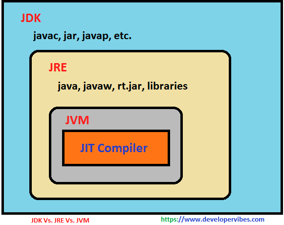

- **기술적 정의(JVM 스펙)**

    JVM은 코드를 실행하고 해당 코드에 대해 런타임 환경을 제공하는 소프트웨어 프로그램에 대한 사양(Specification)이다.

- **일반적 정의(JVM 인스턴스)**

    JVM은 자바 프로그램을 실행하는 방법이다. JVM의 설정을 구성한 다음 설정사항에 따라 실행 중에 프로그램 리소스를 관리한다.

[출처] [http://www.itworld.co.kr/news/110837](http://www.itworld.co.kr/news/110837)

- **JVM이란?**
    - 시스템 메모리를 관리하면서 자바 기반 어플리케이션을 위해 이식 가능한 실행 환경을 제공한다.
    - Java와 OS 사이에서 중개자 역할을 수행하여 Java가 OS에 구애받지 않고 재사용을 가능하게 해준다.(Write once, Run everywhere.)
- **실행과정**
    1. 프로그램이 실행되면 JVM은 OS로부터 이 프로그램이 필요로 하는 메모리를 할당 받는다. JVM은 이 메모리를 용도에 따라 여러 영역으로 나누어 관리한다.
    2. 자바 컴파일러(javac)가 자바소스(.java)코드를 읽어 들여 자바 바이트코드(.class)로 변환시킨다.
    3. 이 변경된 Class 파일들을 Class Loader를 통해 JVM 메모리영역(Runtime Data Areas) 영역으로 로딩한다.
    4. 로딩된 class파일들은 Execution engine을 통해 해석된다.
    5. 해석된 바이트코드는 Runtime Data Areas에 배치되어 실질적인 수행이 이루어지게된다. 이러한 실행과정 속에서 JVM은 필요에 따라 Thread Synchronization과 GC같은 관리 작업을 수행한다.

[출처] [https://asfirstalways.tistory.com/158](https://asfirstalways.tistory.com/158)

### JDK vs JRE vs JVM

[ JDK ]

- Java Development Kit
- JRE에서 개발을 위해 필요한 도구들을 포함한다.

[ JRE ]

- Java Runtime Environment
- JVM이 자바 프로그램을 동작시킬 때 필요한 라이브러리와 기타 파일들을 가지고 있다.

[ JVM ]

- Java Virtual Machine