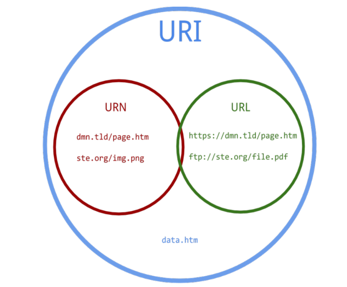

### URI(Uniform Resource Identifier)

- 인터넷에 있는 자원을 나타내는 유일한 식별자
- 자원에 접근하기 위해 사용되는 절차
    - 어떤 자원을 가지고 있는 특정한 컴퓨터
    - 컴퓨터 상의 유니크한 자원의 이름(파일명)
- URI의 부분집합으로 URL, URN이 있음
- `http://test.com/test.pdf?docid=111` , `http://test.com/test.pdf?docid=112` 는 같은 URL을 가지고 다른 URI를 가짐

### URL(Uniform Resource Locator)

- 인터넷 상의 자원의 위치
- `http://img0.gmodules.com/ig/images/korea/logo.gif` 는 URL이자 URI

### URN(Uniform Resource Name)

- 리소스의 위치에 영향 받지 않는 유일무이한 이름 역할
- 여러 종류의 네트워크 접속 프로토콜로 접근해도 문제없다.